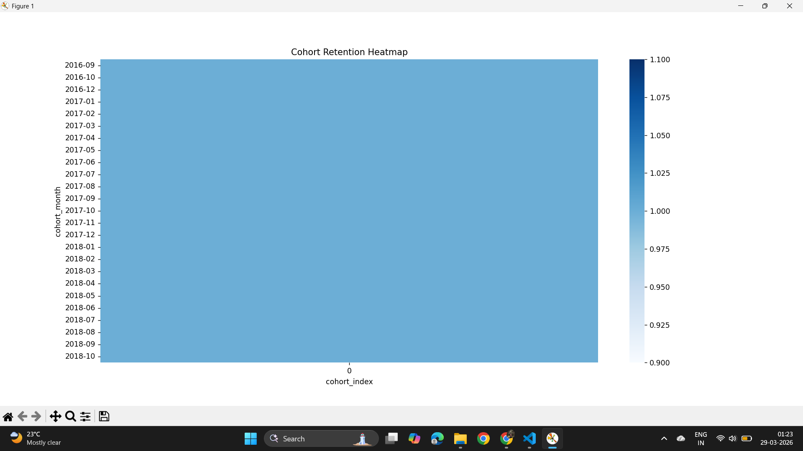

# Cohort Retention Analysis

## 📌 Problem Statement

Understanding customer retention is critical for any business. While acquiring users is important, retaining them over time determines long-term growth.

This project analyzes customer purchase behavior to track how users return over time after their first purchase.

---

## 🎯 Objective

* Group customers into cohorts based on first purchase month
* Track user retention over time
* Identify drop-off patterns across cohorts

---

## 📂 Dataset

* Source: Kaggle
* Dataset: Brazilian E-commerce Dataset (Olist)

⚠️ Note: Dataset is not included due to size constraints.

### Steps to use:

1. Download dataset from Kaggle
2. Use file: `olist_orders_dataset.csv`
3. Rename it to `raw.csv`
4. Place it in project folder

---

## ⚙️ Approach

### 1. Data Preprocessing

* Converted timestamps to datetime format
* Extracted order month from timestamp

### 2. Cohort Creation

* Assigned each user to a cohort based on first purchase month

### 3. Cohort Index

* Calculated time difference (in months) between first purchase and subsequent purchases

### 4. Retention Matrix

* Counted unique users per cohort per month
* Transformed into pivot table

### 5. Retention Calculation

* Converted values into percentage retention

---

## 📊 Output

The output is a retention matrix where:

* Rows → Cohort month
* Columns → Months since first purchase
* Values → Retention percentage

Example:

| Cohort   | Month 0 | Month 1 | Month 2 |
| -------- | ------- | ------- | ------- |
| Jan 2023 | 100%    | 60%     | 40%     |

---

## 📁 Output Files

* `retention_matrix.csv` → cohort retention table

---

## 🛠️ Tech Stack

* Python
* Pandas

---

## 🔍 Key Insights

* User retention drops significantly after the first month
* Early engagement is critical for long-term retention
* Different cohorts show varying retention patterns

---

## ⚠️ Observations

* Retention declines sharply after initial interaction
* Dataset may have limited repeat purchases, affecting retention trends

---

## 🧠 Conclusion

This project demonstrates how cohort analysis can be used to understand user behavior over time and identify retention patterns.

---

## 🚀 Future Improvements

* Add heatmap visualization
* Perform cohort segmentation by region or category
* Integrate dashboard for real-time analysis

---

## 📁 Project Structure

```
cohort-retention-analysis/
│
├── cohort_analysis.py
├── retention_matrix.csv
├── README.md
├── requirements.txt
├── resultt.png
├──retention_heatmap.png

```
## 📊 Sample Output

### 🔹 Retention Heatmap


