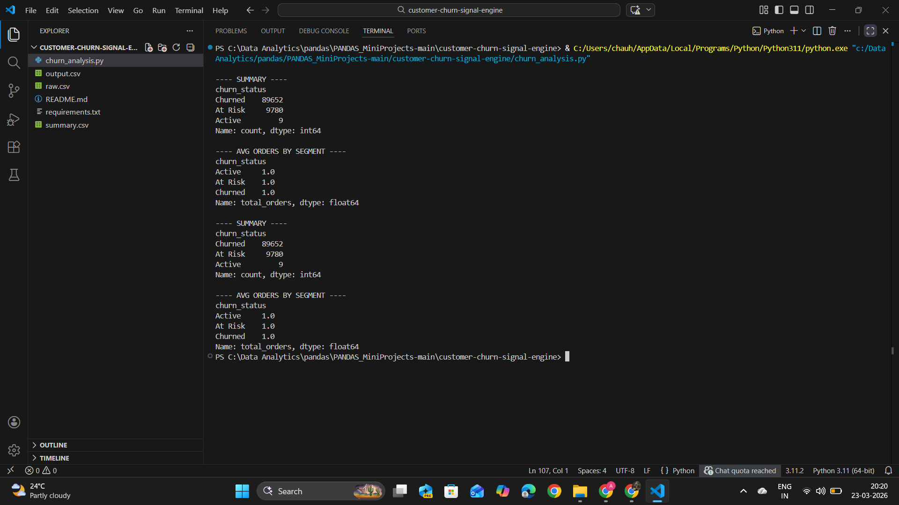

# Customer Churn Signal Engine

## 📌 Problem Statement

Customer churn is a critical challenge for businesses. Companies often fail to identify early signs of user disengagement, leading to revenue loss and reduced customer retention.

This project analyzes customer transaction data to detect early churn signals using behavioral patterns.

---

## 🎯 Objective

* Analyze customer activity over time
* Measure inactivity patterns
* Segment users based on churn risk
* Generate actionable business insights

---

## 📂 Dataset

* Source: Kaggle
* Dataset: Brazilian E-commerce Dataset (Olist)

⚠️ Note: Dataset is not included due to size constraints.

### Steps to use:

1. Download dataset from Kaggle
2. Use file: `olist_orders_dataset.csv`
3. Rename it to `raw.csv`
4. Place it in project folder

---

## ⚙️ Approach

### 1. Data Preprocessing

* Converted timestamps to datetime format
* Sorted data by customer and time

### 2. Feature Engineering

* Last activity date per customer
* Total number of orders
* Days since last activity

### 3. Churn Classification

Customers are segmented based on inactivity:

* **Active** → ≤ 30 days
* **At Risk** → 31–90 days
* **Churned** → > 90 days

### 4. Analysis

* Distribution of customers across segments
* Average order frequency per segment

---

## 📊 Sample Output



---

## 📁 Output Files

* `output.csv` → customer-level churn data
* `summary.csv` → aggregated churn insights

---

## 🛠️ Tech Stack

* Python
* Pandas
* NumPy

---

## 🔍 Key Insights

* A large portion of customers fall into "At Risk" and "Churned" segments
* Customers with frequent purchases show lower churn probability
* Days since last activity is a strong indicator of churn

---

## ⚠️ Observations

* The dataset shows heavy class imbalance (very few active users)
* This may indicate aggressive thresholds or dataset limitations

---

## 🧠 Conclusion

This project demonstrates how rule-based analysis using Pandas can effectively identify churn patterns and provide actionable insights for business decision-making.

---

## 🚀 Future Improvements

* Add visualization dashboard
* Introduce predictive modeling
* Automate data pipeline

---

## 📁 Project Structure

```
customer-churn-signal-engine/
│
├── churn_analysis.py
├── output.csv
├── summary.csv
├── result1.png
├── README.md
├── requirements.txt
```
